## 🐧 Part 1: Preparing Your System Foundation

### 🤔 Understanding Ubuntu's Package Management Philosophy

Ubuntu ships with **snap packages** by default. Think of them as little software containers 📦. While they're secure, they can be slow and clunky for developers.

We'll be using **native packages**, which are faster and integrate better with the system. It's what the pros do! 😉

Here's a look at the process:

```mermaid
graph TD
    subgraph System Cleanup
        A[🚫 Block Snap] --> B[🗑️ Remove Snap Packages];
        B --> C[🧹 Purge Snapd];
    end
    C --> D[🦊 Install Firefox];
    D --> E[🛠️ Install Essential Tools];
```



**The snap removal process** starts by telling your system not to install snaps automatically.

```bash
# Create a preferences file to block snap
sudo nano /etc/apt/preferences.d/nosnap.pref
```

Add this configuration:
```
# To prevent repository packages from triggering the installation of snap,
# this file forbids snapd from being installed by APT.
Package: snapd
Pin: release a=*
Pin-Priority: -10
```

This tells your package manager to never install `snapd`.

### 🗑️ Removing Snap Completely

**Step 1: List and remove snap packages**
```bash
# See what's installed
snap list

# Remove packages in this order
sudo snap remove --purge firefox
sudo snap remove --purge snap-store
sudo snap remove --purge gnome-42-2204  # Version may vary
sudo snap remove --purge gtk-common-themes
sudo snap remove --purge snapd-desktop-integration
sudo snap remove --purge firmware-updater
sudo snap remove --purge bare
sudo snap remove --purge core22  # Or core20/core24
sudo snap remove --purge snapd
```

**Step 2: Disable snap services**
```bash
# Stop services
sudo systemctl stop snapd.socket snapd.service snapd.seeded.service

# Disable them
sudo systemctl disable snapd.socket snapd.service snapd.seeded.service

# Mask to prevent any activation
sudo systemctl mask snapd
```

**Step 3: Purge snapd and clean up**
```bash
# Remove configuration files
sudo apt purge snapd

# Prevent updates from reinstalling it
sudo apt-mark hold snapd

# Remove snap directories
rm -rf ~/snap
sudo rm -rf /snap /var/snap /var/lib/snapd /var/cache/snapd /usr/lib/snapd

# Fix any leftover issues
sudo aa-remove-unknown
```