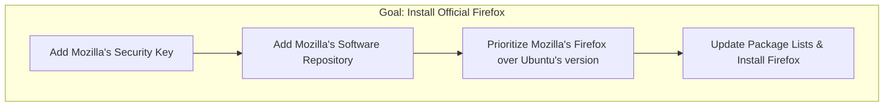

# 🦊 02: Installing Firefox Natively

Now that we've removed the Snap system, we've also removed its version of Firefox. Our goal now is to install Firefox back onto our system, but in a better, more professional way.

### 🤔 Why Install Firefox This Way?

Instead of using a Snap, we will install Firefox directly from Mozilla's own software repository. A **repository** is a trusted, centralized place where software is stored and maintained. By using Mozilla's official repository, we ensure we get the fastest, most up-to-date version of Firefox, directly from its creators.

### ✨ The Goal

We will add the official Mozilla repository to our system's package manager (`apt`), and then install Firefox from it. This ensures we always have the latest and greatest version.



---

Choose the guide that best fits your experience level below.

<details>
<summary>
  <strong>🌱 I'm a Complete Beginner</strong> - Click for a gentle, step-by-step guide.
</summary>

### Let's Get a Better Firefox!

We are going to tell our computer where to find the official Firefox. It's like adding a new, trusted app store to your system.

**Step 1: Add Mozilla's Security Key**

A security key (or GPG key) proves that the software we are installing is authentic and hasn't been tampered with. It's a digital signature.

```bash
# This command downloads Mozilla's key and adds it to your trusted keys.
wget -q https://packages.mozilla.org/apt/repo-signing-key.gpg -O- | sudo tee /etc/apt/keyrings/packages.mozilla.org.asc > /dev/null
```

**Step 2: Add the Mozilla Repository**

Now, let's tell your computer the address of Mozilla's "app store".

```bash
# This command creates a new software source list for Mozilla.
echo "deb [signed-by=/etc/apt/keyrings/packages.mozilla.org.asc] https://packages.mozilla.org/apt mozilla main" | sudo tee -a /etc/apt/sources.list.d/mozilla.list > /dev/null
```

**Step 3: Prioritize Mozilla's Firefox**

This step is important. It tells your system, "If I ask for Firefox, always get it from Mozilla, not from the default Ubuntu sources."

```bash
# This creates a rule to prioritize Mozilla's packages.
echo 'Package: *
Pin: origin packages.mozilla.org
Pin-Priority: 1000

Package: firefox*
Pin: release o=Ubuntu
Pin-Priority: -1' | sudo tee /etc/apt/preferences.d/mozilla
```

**Step 4: Install Firefox!**

Now that everything is set up, we can finally install Firefox.

```bash
# 'apt update' refreshes your list of available software.
# 'apt install firefox' installs the program.
sudo apt update && sudo apt install firefox -y
```
The `&&` just means "if the first command succeeds, then run the second one." The `-y` automatically says "yes" to the installation.

You now have the official, native version of Firefox installed!

</details>

<details>
<summary>
  <strong>🪟 I'm Coming From Windows</strong> - Click for a technical guide.
</summary>

### Installing Firefox via a Third-Party APT Repository

Since the default Snap version of Firefox was removed, we'll now install it directly from the official Mozilla APT repository. This process is analogous to adding a new source or bucket in a Windows package manager like Chocolatey or Scoop.

**Step 1: Import the Repository's GPG Key**

First, we'll import Mozilla's GPG signing key to ensure the authenticity of the packages. This is a standard security practice for APT repositories.

```bash
# Download the key and save it to the trusted keyrings directory.
wget -q https://packages.mozilla.org/apt/repo-signing-key.gpg -O- | sudo tee /etc/apt/keyrings/packages.mozilla.org.asc > /dev/null
```

**Step 2: Add the Mozilla APT Repository**

Next, we'll add the Mozilla repository to the system's sources list.

```bash
# Create a new source file pointing to the Mozilla repository.
echo "deb [signed-by=/etc/apt/keyrings/packages.mozilla.org.asc] https://packages.mozilla.org/apt mozilla main" | sudo tee -a /etc/apt/sources.list.d/mozilla.list > /dev/null
```

**Step 3: Configure APT Pinning**

To ensure the system prefers Mozilla's version of Firefox over any version in the standard Ubuntu repositories, we'll configure APT pinning.

```bash
# Create a preference file to give Mozilla's packages a higher priority.
# It also prevents Ubuntu's version from being chosen.
echo 'Package: *
Pin: origin packages.mozilla.org
Pin-Priority: 1000

Package: firefox*
Pin: release o=Ubuntu
Pin-Priority: -1' | sudo tee /etc/apt/preferences.d/mozilla
```

**Step 4: Update and Install**

Finally, update the package index and install Firefox.

```bash
# Update the package list and then install the 'firefox' package.
sudo apt update && sudo apt install firefox -y
```

Firefox is now installed natively from the official Mozilla source.

</details>

<details>
<summary>
  <strong>🚀 I'm an Experienced User</strong> - Click for the quick script.
</summary>

### Install Firefox from Mozilla APT Repo

This script adds the Mozilla APT repository, pins it, and installs the latest version of Firefox.

```bash
# Add Mozilla GPG key
wget -q https://packages.mozilla.org/apt/repo-signing-key.gpg -O- | sudo tee /etc/apt/keyrings/packages.mozilla.org.asc > /dev/null

# Add Mozilla repository
echo "deb [signed-by=/etc/apt/keyrings/packages.mozilla.org.asc] https://packages.mozilla.org/apt mozilla main" | sudo tee -a /etc/apt/sources.list.d/mozilla.list > /dev/null

# Set package priority
echo 'Package: *
Pin: origin packages.mozilla.org
Pin-Priority: 1000

Package: firefox*
Pin: release o=Ubuntu
Pin-Priority: -1' | sudo tee /etc/apt/preferences.d/mozilla

# Update and install
sudo apt update && sudo apt install firefox -y

echo "Firefox has been installed from the Mozilla repository."
```

</details>

---

### Next Steps

Great! You now have a proper, fast web browser. Next, we'll install some essential command-line tools.

➡️ **Next: [03: Essential Packages](./03-essential-packages.md)**

⬅️ **Previous: [01: Removing Snap](./01-removing-snap.md)**

↩️ **Back to [Main Menu](../../README.md)**
