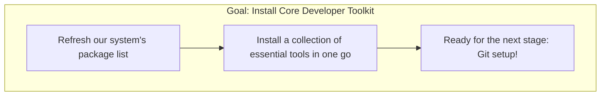

# 🛠️ 03: Installing Essential Developer Packages

With your system clean and your browser installed, it's time to install the foundational toolkit that you'll use for almost every project.

### 🤔 What Are These Packages?

These are not graphical applications with icons, but powerful command-line utilities. They work in the background and are used by other developer tools to build software, download files, and manage projects. Installing them now gets your system ready for real development work.

### ✨ The Goal

Our objective is to install a curated list of essential packages using a single command. This will form the bedrock of your development environment.



---

Choose the guide that best fits your experience level below.

<details>
<summary>
  <strong>🌱 I'm a Complete Beginner</strong> - Click for a simple breakdown of the tools.
</summary>

### Building Your Developer Toolbox

We're going to install a bunch of useful tools at once. Think of it like getting a brand-new toolbox with all the essential wrenches, screwdrivers, and hammers you'll need for future projects.

Just copy and paste this one big command into your terminal and press Enter. It tells the `apt` package manager to update its list of software and then install everything in the list.

```bash
sudo apt update && sudo apt install -y \
  build-essential \
  git \
  curl \
  wget \
  software-properties-common \
  apt-transport-https \
  ca-certificates \
  gnupg \
  lsb-release \
  pkg-config \
  python3-dev \
  python3-pip
```

**What are these tools?**

*   **`build-essential`**: The most important one! It includes tools that compile source code into programs you can run.
*   **`git`**: The version control system. It's like a time machine for your code, letting you save your progress and collaborate with others. We'll learn more about this in the next section.
*   **`curl` & `wget`**: Simple tools for downloading files or data from the internet using the command line.
*   **`python3-dev` & `python3-pip`**: Tools that let you build and install extra components for the Python programming language.
*   **The others** (`software-properties-common`, `apt-transport-https`, etc.): These are helper tools that let you securely add new software sources and manage packages.

You don't need to be an expert on all of these right now! Just know that they are working in the background to make your life as a developer easier.

</details>

<details>
<summary>
  <strong>🪟 I'm Coming From Windows</strong> - Click for a technical guide.
</summary>

### Installing a Base Development Toolchain

This step installs a standard set of packages required for most development workflows on a Debian-based system like Ubuntu. This is analogous to setting up the Visual Studio Build Tools, Git for Windows, and other core utilities on a Windows machine.

Run the following command to update your APT index and install the entire toolchain:

```bash
sudo apt update && sudo apt install -y \
  build-essential \
  git \
  curl \
  wget \
  software-properties-common \
  apt-transport-https \
  ca-certificates \
  gnupg \
  lsb-release \
  pkg-config \
  python3-dev \
  python3-pip
```

**Package Breakdown:**

*   **`build-essential`**: A meta-package that installs the GNU C/C++ compilers (`gcc`/`g++`) and other utilities like `make`. This is the core C/C++ build toolchain.
*   **`git`**: The distributed version control system.
*   **`curl` & `wget`**: Command-line tools for transferring data with URLs. `curl` is generally more powerful, while `wget` is simpler for direct downloads.
*   **`software-properties-common` & `apt-transport-https`**: Utilities for managing APT repositories, especially PPAs (Personal Package Archives) and those using HTTPS.
*   **`ca-certificates` & `gnupg`**: Provide SSL certificates and the GNU Privacy Guard utility for cryptographic key management, essential for secure package verification.
*   **`pkg-config`**: A helper tool that provides compiler and linker flags for libraries to other build systems.
*   **`python3-dev` & `python3-pip`**: Installs the headers and development libraries for building Python C extensions, and `pip`, the package installer for Python.

With these packages installed, your system is now equipped to handle a wide range of development and build tasks.

</details>

<details>
<summary>
  <strong>🚀 I'm an Experienced User</strong> - Click for the quick script.
</summary>

### Install Base Development Packages

Run the following to update APT and install a standard set of development packages.

```bash
sudo apt update && sudo apt install -y \
  build-essential \
  git \
  curl \
  wget \
  software-properties-common \
  apt-transport-https \
  ca-certificates \
  gnupg \
  lsb-release \
  pkg-config \
  python3-dev \
  python3-pip
```

</details>

---

### Next Steps

Congratulations! You've finished the initial system setup. Your Ubuntu environment is now a clean, stable, and powerful foundation.

Now, let's move on to the next major section: setting up Git and GitHub.

➡️ **Next Section: [02-git-and-github/01-git-configuration.md](../../02-git-and-github/01-git-configuration.md)**

⬅️ **Previous: [02: Installing Firefox](./02-installing-firefox.md)**

↩️ **Back to [Main Menu](../../README.md)**