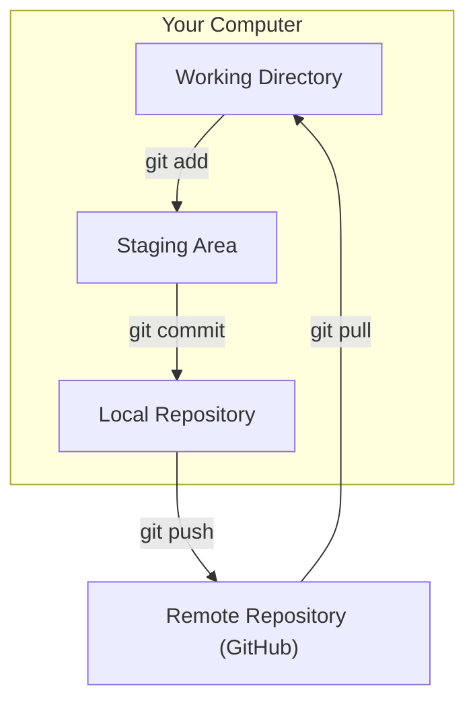

# 🐙 01: Configuring Git for Professional Use

Welcome to the Git & GitHub section! Now that Git is installed, our first step is to configure it. This is a crucial, one-time setup on any new machine.

### 🤔 Why Configure Git?

Think of this as setting up your preferences in a new application. We're telling Git who you are, what your preferred text editor is, and setting some smart defaults that will make your development workflow smoother and more professional. These settings are stored in a global `.gitconfig` file in your home directory, so you only have to do this once.

### ✨ The Goal

Our objective is to set your developer identity and establish several best-practice configurations that will improve your experience using Git.

#### The Basic Git Workflow

Before we configure it, here's a reminder of how Git works. Your configurations will affect commands like `git commit`.



---

Choose the guide that best fits your experience level below.

<details>
<summary>
  <strong>🌱 I'm a Complete Beginner</strong> - Click for a gentle, step-by-step guide.
</summary>

### Setting Up Your Git Identity

We need to tell Git your name and email address. Every time you save a change (make a "commit"), this information is attached as your digital signature. It's important to use the same email you used to sign up for GitHub.

**Step 1: Set Your Name and Email**

Remember to replace `"Your Full Name"` and `"your.email@example.com"` with your actual name and email.

```bash
# Sets the name that will appear on your commits
git config --global user.name "Your Full Name"

# Sets the email that will be associated with your commits
git config --global user.email "your.email@example.com"
```

**Step 2: Set Your Default Text Editor**

Sometimes, Git needs to open a text editor (for example, when you write a detailed commit message). This command tells Git to use Visual Studio Code, which we'll install later.

```bash
# Sets VS Code as the default editor for Git
git config --global core.editor "code --wait"
```

**Step 3: Set Some Helpful Defaults**

These next commands set up some modern conventions and helpful behaviors in Git. You don't need to memorize them, just know they are making Git work better for you.

```bash
# Names the main branch 'main' by default (a modern standard)
git config --global init.defaultBranch main

# Helps resolve conflicts in a cleaner way
git config --global merge.conflictstyle diff3

# A better algorithm for comparing files
git config --global diff.algorithm histogram

# Makes 'git pull' safer and keeps project history cleaner
git config --global pull.rebase true

# Automatically cleans up old branches that no longer exist on the remote
git config --global fetch.prune true
```

That's it! Your Git is now configured like a pro.

</details>

<details>
<summary>
  <strong>🪟 I'm Coming From Windows</strong> - Click for a technical guide.
</summary>

### Configuring Your Global `.gitconfig`

These commands will populate your global `.gitconfig` file with essential identity settings and widely accepted best practices for a smoother workflow. The commands are identical across platforms.

**Step 1: Set Your User Identity**

This information is embedded in every commit you author. Use the same email address associated with your GitHub account.

```bash
# Set your author name and email for all repositories on this machine.
git config --global user.name "Your Full Name"
git config --global user.email "your.email@example.com"
```

**Step 2: Configure Core Settings**

Set VS Code as your default editor and `main` as the default branch name.

```bash
# Set VS Code for interactive commands like writing commit messages.
git config --global core.editor "code --wait"

# Use 'main' for the initial branch in new repositories.
git config --global init.defaultBranch main
```

**Step 3: Set Workflow and Diff Enhancements**

These settings improve the behavior of `pull`, `merge`, and `diff` operations.

```bash
# Use the diff3 style for merge conflicts, which shows the original state.
git config --global merge.conflictstyle diff3

# Use the histogram diff algorithm, which can be more readable.
git config --global diff.algorithm histogram

# Set `pull.rebase = true` to avoid unnecessary merge commits on `git pull`.
# This maintains a linear and cleaner project history.
git config --global pull.rebase true

# Automatically prune remote-tracking branches that no longer exist on the remote.
git config --global fetch.prune true
```

Your Git configuration is now optimized for a modern, clean workflow.

</details>

<details>
<summary>
  <strong>🚀 I'm an Experienced User</strong> - Click for the quick script.
</summary>

### Global Git Configuration Script

Run the following commands to set up your global Git configuration. Remember to substitute your own name and email.

```bash
# Identity
git config --global user.name "Your Full Name"
git config --global user.email "your.email@example.com"

# Editor
git config --global core.editor "code --wait"

# Branch and Workflow
git config --global init.defaultBranch main
git config --global pull.rebase true
git config --global fetch.prune true

# Diff and Merge
git config --global merge.conflictstyle diff3
git config --global diff.algorithm histogram

echo "Global .gitconfig has been configured."
```

</details>

---

### Next Steps

With your Git identity set, the next step is to set up SSH keys for secure, password-free authentication with GitHub.

➡️ **Next: [02: Setting Up SSH Keys](./02-ssh-keys.md)**

⬅️ **Previous Section: [01-ubuntu-setup/03-essential-packages.md](../../01-ubuntu-setup/03-essential-packages.md)**

↩️ **Back to [Main Menu](../../README.md)**
