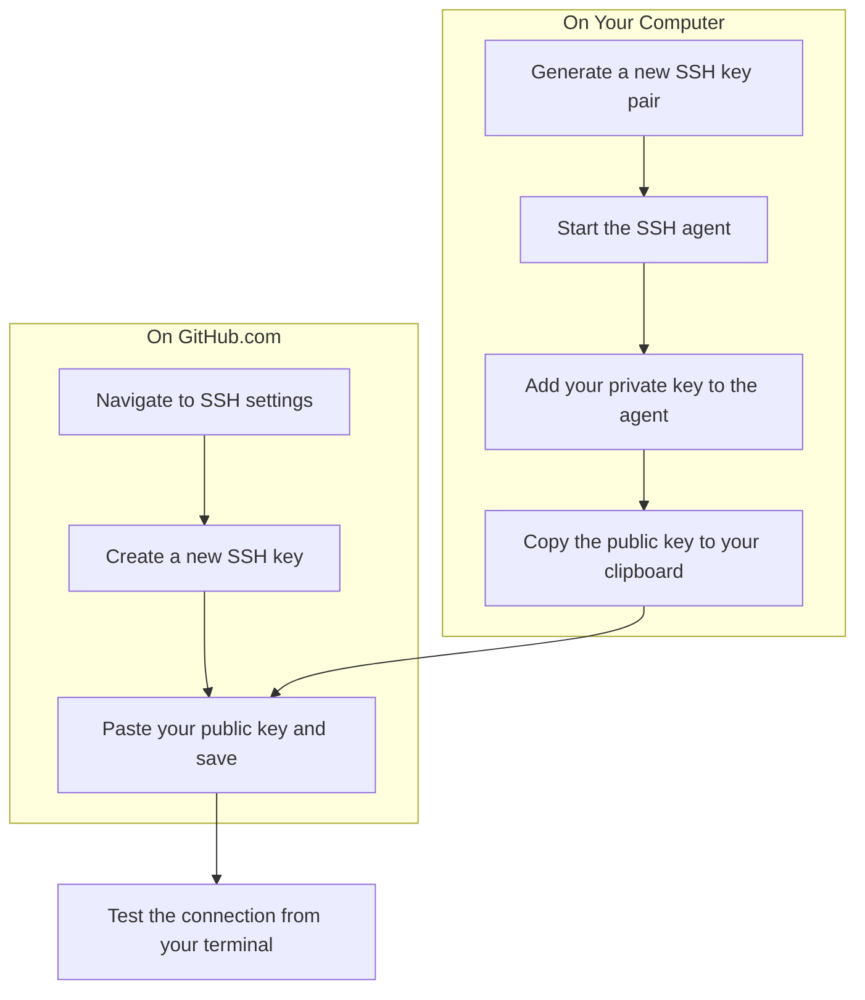

# 🔑 02: Setting Up SSH Keys for GitHub Authentication

In this step, we'll set up SSH keys. This is the preferred way to communicate with services like GitHub because it's both highly secure and very convenient, as you won't have to type your password every time.

### 🤔 What is an SSH Key?

An SSH key is a pair of cryptographic keys: a **private key** and a **public key**.
*   The **private key** stays on your computer. It's a secret file and you must never share it.
*   The **public key** is what you give to services like GitHub. It's like a public-facing lock.

When you connect to GitHub, it will use your public key to "lock" a challenge message that only your private key can "unlock." This proves your identity without sending a password over the internet.

### ✨ The Goal

We will generate a new SSH key pair, add it to our system's "keychain" (the SSH agent), and provide the public key to GitHub.



---

Choose the guide that best fits your experience level below.

<details>
<summary>
  <strong>🌱 I'm a Complete Beginner</strong> - Click for a gentle, step-by-step guide.
</summary>

### Creating Your Secure Handshake

Let's create your secure key pair. Don't worry, the commands do all the hard work!

**Step 1: Generate Your Keys**

This command creates a new SSH key using a modern and secure algorithm called `ed25519`. Make sure to replace `your.email@example.com` with your GitHub email address.

```bash
ssh-keygen -t ed25519 -C "your.email@example.com"
```
When it asks "Enter a file in which to save the key," just press **Enter** to accept the default location.
When it asks for a passphrase, you can either type one in (for extra security) or press **Enter** twice to have no passphrase. For this guide, we'll skip the passphrase to keep things simple.

**Step 2: Start the "SSH Agent"**

The SSH agent is a background program that securely holds your private key so you don't have to type your passphrase all the time.

```bash
# This command starts the agent.
eval "$(ssh-agent -s)"
```

**Step 3: Add Your Key to the Agent**

Now, tell the agent about your new private key.

```bash
# This adds your new key to the agent's keychain.
ssh-add ~/.ssh/id_ed25519
```

**Step 4: Get Your Public Key**

We need to copy your public key so we can give it to GitHub.

```bash
# This command displays your public key in the terminal.
cat ~/.ssh/id_ed25519.pub
```
The output will be a long string of text starting with `ssh-ed25519...`. **Highlight this entire block of text and copy it** to your clipboard (`Ctrl+Shift+C` in most terminals).

**Step 5: Add the Key to GitHub**

1.  Go to [github.com](https://github.com) and log in.
2.  Click your profile picture in the top-right corner, then click **Settings**.
3.  In the left sidebar, click **SSH and GPG keys**.
4.  Click the **New SSH key** button.
5.  Give it a **Title** that you'll recognize, like "My Ubuntu Desktop".
6.  Paste your copied public key into the **Key** field.
7.  Click **Add SSH key**.

**Step 6: Test Your Connection**

Let's make sure it all worked.

```bash
# This command attempts to connect to GitHub over SSH.
ssh -T git@github.com
```
You may see a warning about the authenticity of the host. Type **yes** and press Enter. If everything is correct, you will see a message like: `Hi your-username! You've successfully authenticated...`

Congratulations! You now have a secure, password-free connection to GitHub.

</details>

<details>
<summary>
  <strong>🪟 I'm Coming From Windows</strong> - Click for a technical guide.
</summary>

### Setting Up OpenSSH Keys

This process uses the standard OpenSSH client to generate keys, which is the default on Linux. It's analogous to using `ssh-keygen.exe` and `pageant.exe` on Windows, but integrated directly into the shell.

**Step 1: Generate an Ed25519 Key Pair**

We'll generate a modern `ed25519` key pair.

```bash
# Generate the key, associating it with your email.
ssh-keygen -t ed25519 -C "your.email@example.com"
```
Press Enter to accept the default file path (`~/.ssh/id_ed25519`). It's recommended to use a strong passphrase for production keys, but you can leave it blank for this setup.

**Step 2: Ensure the SSH Agent is Running**

The `ssh-agent` caches your decrypted private keys in memory.

```bash
# Start the agent and add its environment variables to the current shell.
eval "$(ssh-agent -s)"
```

**Step 3: Add the Key to the Agent**

Register the newly created private key with the agent.

```bash
# Add the identity to the agent.
ssh-add ~/.ssh/id_ed25519
```

**Step 4: Copy the Public Key**

Copy the public key content to your clipboard. You can use a tool like `xclip` if you have it installed, or just `cat` and copy manually.

```bash
# Display the public key for copying.
cat ~/.ssh/id_ed25519.pub
```

**Step 5: Add the Public Key to GitHub**

1.  Navigate to your [SSH and GPG keys settings](https://github.com/settings/keys) on GitHub.
2.  Click **New SSH key**.
3.  Provide a descriptive title and paste the public key (`id_ed25519.pub`) content into the "Key" field.
4.  Click **Add SSH key**.

**Step 6: Test the Authentication**

Verify the connection to GitHub's SSH server.

```bash
# Authenticate to GitHub.
ssh -T git@github.com
```
Accept the host key fingerprint if prompted. A successful connection will greet you with your GitHub username.

</details>

<details>
<summary>
  <strong>🚀 I'm an Experienced User</strong> - Click for the quick script.
</summary>

### SSH Key Setup Script

1.  Generate an `ed25519` key. Replace the email with your own.
2.  Start the agent and add the key.
3.  Copy the public key and add it to [GitHub Settings](https://github.com/settings/keys).
4.  Test the connection.

```bash
# 1. Generate key (press Enter for defaults)
ssh-keygen -t ed25519 -C "your.email@example.com"

# 2. Start agent and add key
eval "$(ssh-agent -s)"
ssh-add ~/.ssh/id_ed25519

# 3. Display public key to copy
echo "Your public key is:"
cat ~/.ssh/id_ed25519.pub
echo "Add the key above to https://github.com/settings/keys"

# 4. Test connection
echo "Testing connection to GitHub..."
ssh -T git@github.com
```

</details>

---

### Next Steps

Your machine can now securely talk to GitHub. Next, we'll set up some handy Git aliases to make you more productive.

➡️ **Next: [03: Supercharging Git with Aliases](./03-git-aliases.md)**

⬅️ **Previous: [01: Configuring Git](./01-git-configuration.md)**

↩️ **Back to [Main Menu](../../README.md)**
