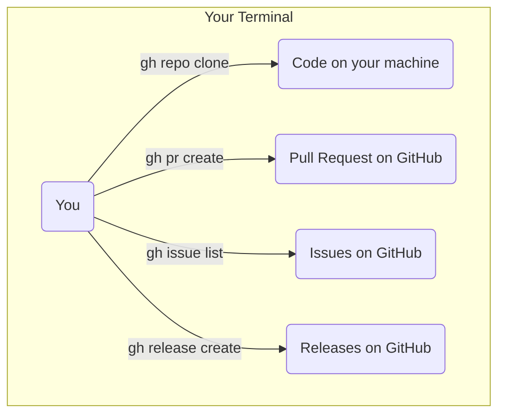

# 🐙 04: Mastering GitHub from the Command Line with `gh`

The final step in this section is to install the official GitHub Command-Line Interface (CLI), called `gh`. This powerful tool brings GitHub's features right into your terminal.

### 🤔 What is the GitHub CLI?

While `git` is perfect for managing your code's history, `gh` is for interacting with your repositories on GitHub.com. You can create pull requests, view issues, manage your repositories, and much more, all without leaving your command-line environment. It's a huge productivity booster.

### ✨ The Goal

We will install the `gh` CLI, add the official GitHub repository to our system, and authenticate our new CLI with our GitHub account.



---

Choose the guide that best fits your experience level below.

<details>
<summary>
  <strong>🌱 I'm a Complete Beginner</strong> - Click for a gentle, step-by-step guide.
</summary>

### Bringing GitHub to Your Terminal

Let's install `gh`. This process involves telling your system where to find the software (adding a repository) and then installing it.

**Step 1: Add GitHub's Security Key**

Just like with Firefox, we first need to add a key to prove the software is authentic.

```bash
# This series of commands downloads and installs GitHub's official key
sudo mkdir -p -m 755 /etc/apt/keyrings
wget -qO- https://cli.github.com/packages/githubcli-archive-keyring.gpg | sudo tee /etc/apt/keyrings/githubcli-archive-keyring.gpg > /dev/null
sudo chmod go+r /etc/apt/keyrings/githubcli-archive-keyring.gpg
```

**Step 2: Add the GitHub CLI Repository**

Now, let's tell your system the address of the `gh` "app store".

```bash
# This command adds the official GitHub CLI software source.
echo "deb [arch=$(dpkg --print-architecture) signed-by=/etc/apt/keyrings/githubcli-archive-keyring.gpg] https://cli.github.com/packages stable main" | sudo tee /etc/apt/sources.list.d/github-cli.list > /dev/null
```

**Step 3: Install `gh`**

Now we can update our software lists and install `gh`.

```bash
# Update apt and install gh
sudo apt update
sudo apt install gh -y
```

**Step 4: Log In to Your GitHub Account**

It's time to connect the `gh` tool to your account. This command will start an interactive setup process.

```bash
gh auth login
```

The terminal will ask you a few questions. Here's how to answer them:
1.  `What account do you want to log into?` -> Use the arrow keys to select **GitHub.com** and press Enter.
2.  `What is your preferred protocol for Git operations?` -> Select **HTTPS**.
3.  `Authenticate Git with your GitHub credentials?` -> Select **Yes**.
4.  `How would you like to authenticate?` -> Select **Login with a web browser**.
5.  The tool will give you a **one-time code** and ask you to open a web browser. Copy the code.
6.  Press Enter. Your web browser will open to a GitHub authorization page.
7.  Paste the one-time code into the browser and click **Continue**.
8.  Click **Authorize GitHub**.

Go back to your terminal. Once it's successful, you're all logged in! You can test it with `gh auth status`.

</details>

<details>
<summary>
  <strong>🪟 I'm Coming From Windows</strong> - Click for a technical guide.
</summary>

### Installing and Authenticating the GitHub CLI

This process involves adding the official GitHub APT repository and GPG key, then installing the `gh` package.

**Step 1: Add the GitHub APT Repository**

These commands will add the GPG key and the repository source file required to install `gh`.

```bash
# Create the keyrings directory and add the GPG key
sudo mkdir -p -m 755 /etc/apt/keyrings
wget -qO- https://cli.github.com/packages/githubcli-archive-keyring.gpg | sudo tee /etc/apt/keyrings/githubcli-archive-keyring.gpg > /dev/null
sudo chmod go+r /etc/apt/keyrings/githubcli-archive-keyring.gpg

# Add the repository to your sources
echo "deb [arch=$(dpkg --print-architecture) signed-by=/etc/apt/keyrings/githubcli-archive-keyring.gpg] https://cli.github.com/packages stable main" | sudo tee /etc/apt/sources.list.d/github-cli.list > /dev/null
```

**Step 2: Install the Package**

Update the APT index and install the `gh` package.

```bash
sudo apt update
sudo apt install gh -y
```

**Step 3: Authenticate with Your GitHub Account**

Run the interactive login flow.

```bash
gh auth login
```

Follow the prompts. The recommended path is:
*   Account: **GitHub.com**
*   Protocol: **HTTPS**
*   Authenticate Git: **Yes**
*   Method: **Login with a web browser**

This will require you to copy a one-time code from the terminal and paste it into the browser window that opens. After authorizing, the CLI will be fully configured. You can verify with `gh auth status`.

</details>

<details>
<summary>
  <strong>🚀 I'm an Experienced User</strong> - Click for the quick script.
</summary>

### GitHub CLI Install Script

This script adds the GitHub CLI repository and installs the `gh` package.

```bash
# Add repo and key
sudo mkdir -p -m 755 /etc/apt/keyrings
wget -qO- https://cli.github.com/packages/githubcli-archive-keyring.gpg | sudo tee /etc/apt/keyrings/githubcli-archive-keyring.gpg > /dev/null
sudo chmod go+r /etc/apt/keyrings/githubcli-archive-keyring.gpg
echo "deb [arch=$(dpkg --print-architecture) signed-by=/etc/apt/keyrings/githubcli-archive-keyring.gpg] https://cli.github.com/packages stable main" | sudo tee /etc/apt/sources.list.d/github-cli.list > /dev/null

# Install
sudo apt update
sudo apt install gh -y

echo "GitHub CLI installed. Run 'gh auth login' to authenticate."
```

After installation, run `gh auth login` and follow the interactive prompts.

</details>

---

### Next Steps

Fantastic! You have now fully configured Git and GitHub for a professional workflow. Your system is ready for version control.

Next, we'll move on to setting up your core development tools, starting with the JavaScript ecosystem.

➡️ **Next Section: [03-development-tools/01-nvm-and-nodejs.md](../../03-development-tools/01-nvm-and-nodejs.md)**

⬅️ **Previous: [03: Supercharging Git with Aliases](./03-git-aliases.md)**

↩️ **Back to [Main Menu](../../README.md)**
