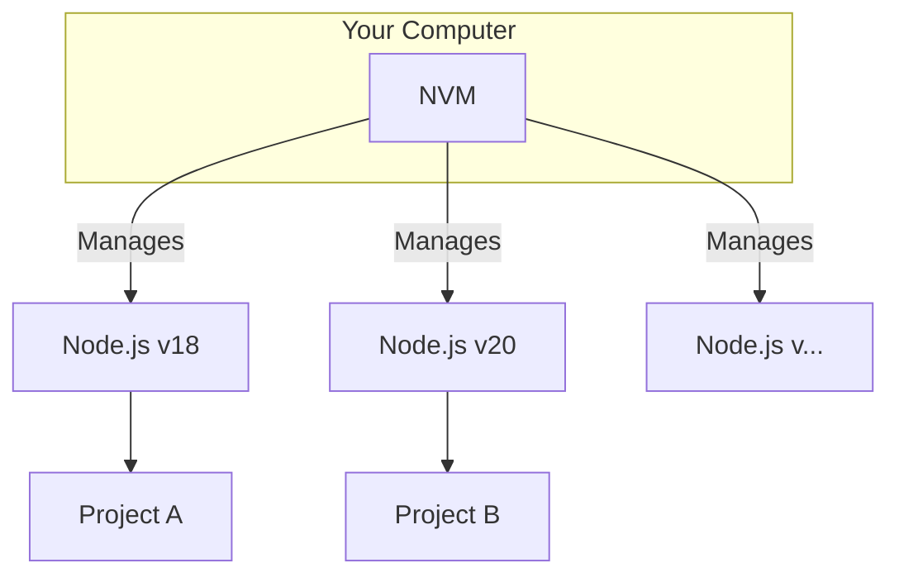

# 🛠️ 01: The JavaScript Ecosystem with NVM & Node.js

Welcome to the development tools section! We'll start by setting up the most popular ecosystem in web development: JavaScript, powered by Node.js and managed with NVM.

### 🤔 What are Node.js and NVM?

*   **Node.js** is a program that lets you run JavaScript code outside of a web browser. It's the foundation for building modern web servers, command-line tools, and much more.
*   **NVM (Node Version Manager)** is a tool to manage multiple versions of Node.js on a single computer. This is crucial because different projects often require different versions of Node.js to work correctly. NVM lets you switch between them effortlessly.

### ✨ The Goal

Our objective is to install NVM, and then use NVM to install a stable, long-term support (LTS) version of Node.js. This is the standard, professional way to set up your JavaScript development environment.



---

Choose the guide that best fits your experience level below.

<details>
<summary>
  <strong>🌱 I'm a Complete Beginner</strong> - Click for a gentle, step-by-step guide.
</summary>

### Getting Started with JavaScript Tools

Let's get you set up to run JavaScript on your computer. We'll use NVM, the Node Version Manager, to do this safely.

**Step 1: Install NVM**

This command downloads and runs the official NVM installation script.

```bash
# This command downloads and runs the installer.
curl -o- https://raw.githubusercontent.com/nvm-sh/nvm/v0.40.3/install.sh | bash
```
After the script finishes, you need to **close and reopen your terminal** for the changes to take effect.

**Step 2: Verify NVM is Installed**

To make sure it worked, run this command. It should show you a version number, like `0.40.3`.

```bash
nvm --version
```

**Step 3: Install a Stable Version of Node.js**

Now, we'll use NVM to install Node.js. We'll install the latest "LTS" version. LTS stands for **Long-Term Support**, which means it's a very stable version that will be supported for a long time. It's perfect for most projects.

```bash
# This command finds and installs the latest LTS version of Node.js.
nvm install --lts
```

**Step 4: Set the Default Version**

This command tells NVM to use the LTS version you just installed as the default for any new terminal you open.

```bash
# This sets your default Node.js to the LTS version.
nvm alias default lts/*
```

**Step 5: Verify Node.js and npm are Installed**

When you install Node.js, you also get `npm` (Node Package Manager), a tool for installing other JavaScript tools. Let's check their versions.

```bash
# Check the Node.js version
node --version

# Check the npm version
npm --version
```
If you see version numbers for both, you are all set! You've successfully set up your JavaScript environment.

</details>

<details>
<summary>
  <strong>🪟 I'm Coming From Windows</strong> - Click for a technical guide.
</summary>

### Setting Up NVM for Linux

If you've used `nvm-windows`, note that this is the original `nvm` project on which it was based. The commands and concepts are very similar, but the installation and shell integration are specific to Linux/macOS.

**Step 1: Install NVM via the Official Install Script**

The recommended way to install `nvm` is via the `curl` script.

```bash
# Download and execute the install script from the nvm-sh GitHub repo.
curl -o- https://raw.githubusercontent.com/nvm-sh/nvm/v0.40.3/install.sh | bash
```
The script modifies your shell profile (`~/.bashrc`, `~/.zshrc`, etc.). You must **close and reopen your terminal** or source the profile (`source ~/.bashrc`) for the `nvm` command to become available.

**Step 2: Verify Installation**

Check that NVM was installed correctly.

```bash
nvm --version
```

**Step 3: Install and Use the Latest LTS Release**

Use `nvm` to install the latest Long-Term Support version of Node.js, which is the recommended version for most applications.

```bash
# Install the latest available LTS version.
nvm install --lts

# Switch to the LTS version in the current shell.
nvm use --lts

# Set the LTS version as the default for all new shells.
nvm alias default lts/*
```

**Step 4: Verify Node.js and npm**

Check the versions of the installed binaries.

```bash
node -v
npm -v
```
Your environment is now configured. Note that with NVM, `npm install -g` installs packages to a user-owned directory, so `sudo` is not required for global package installation.

</details>

<details>
<summary>
  <strong>🚀 I'm an Experienced User</strong> - Click for the quick script.
</summary>

### NVM and Node.js LTS Setup

This script installs NVM, reloads the shell, installs the latest LTS version of Node.js, and sets it as the default.

```bash
# 1. Install NVM
curl -o- https://raw.githubusercontent.com/nvm-sh/nvm/v0.40.3/install.sh | bash

# 2. IMPORTANT: Close and reopen your terminal now for nvm to be available.
# Or, for the current session, run:
export NVM_DIR="$HOME/.nvm"
[ -s "$NVM_DIR/nvm.sh" ] && \. "$NVM_DIR/nvm.sh"
[ -s "$NVM_DIR/bash_completion" ] && \. "$NVM_DIR/bash_completion"

# 3. Verify NVM
nvm --version

# 4. Install and set default Node.js LTS
nvm install --lts
nvm use --lts
nvm alias default lts/*

# 5. Verify installation
echo "Node version: $(node -v)"
echo "npm version: $(npm -v)"
```

</details>

---

### Next Steps

Your JavaScript environment is ready. Next, we'll set up Visual Studio Code, the most popular code editor in the world.

➡️ **Next: [02: Setting Up Visual Studio Code](./02-vscode-setup.md)**

⬅️ **Previous Section: [02-git-and-github/04-github-cli.md](../../02-git-and-github/04-github-cli.md)**

↩️ **Back to [Main Menu](../../README.md)**
