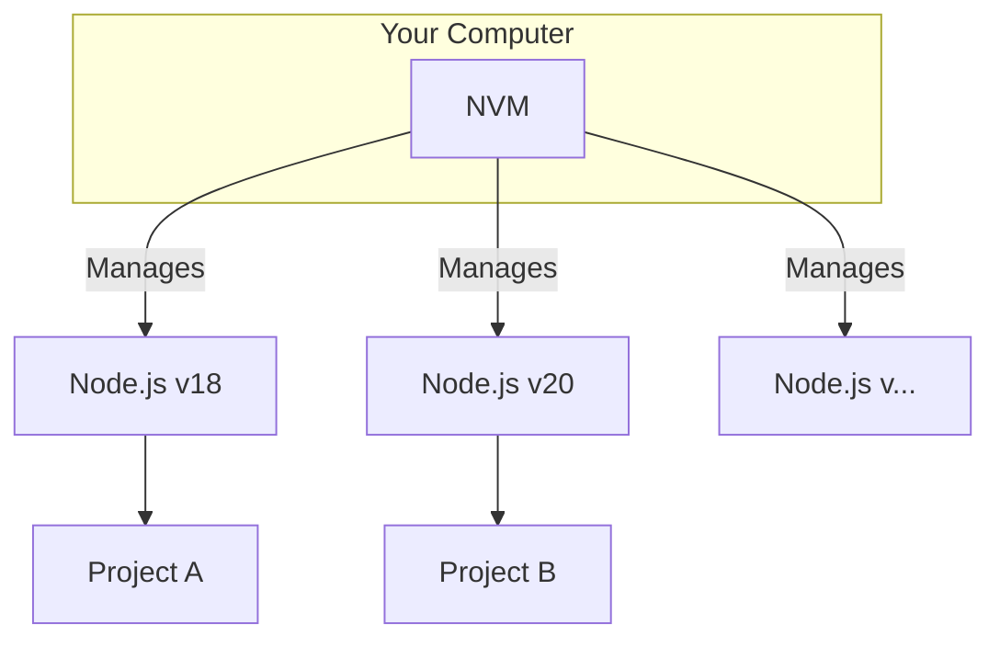

## 🛠️ Part 3: Node.js Ecosystem with NVM

### 🤔 Why NVM Changes Everything for JavaScript Developers

Different projects need different versions of Node.js. NVM (Node Version Manager) lets you switch between versions easily!



**Install NVM** using the official script:
```bash
# Download and install NVM
curl -o- https://raw.githubusercontent.com/nvm-sh/nvm/v0.40.3/install.sh | bash

# Reload your shell configuration
source ~/.bashrc

# Verify installation
nvm --version
```

### 🧑‍💻 Setting up Node.js the Professional Way

```bash
# Install the latest LTS (Long Term Support) version
nvm install --lts
nvm use --lts

# Make it default for all new terminals
nvm alias default lts/*

# Verify your setup
node --version
npm --version
```

**Project-specific Node.js versions** ensure consistency across your team:
```bash
# In your project directory, specify the Node version
echo "18.17.0" > .nvmrc

# Now anyone can use the correct version with
nvm use
```

### 🔓 Solving the Global Package Permission Problem

With NVM, you can install global npm packages without `sudo`! This is much more secure.

```bash
# Install global packages without sudo
npm install -g nodemon
npm install -g create-react-app
npm install -g typescript
```