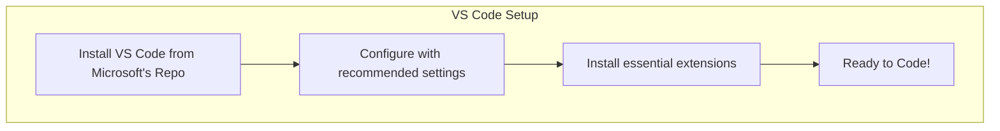

# 💻 02: Setting Up Visual Studio Code

With your core tools and JavaScript environment ready, it's time to install the most important tool for any developer: a great code editor. We'll be installing Visual Studio Code (or VS Code), the world's most popular editor.

### 🤔 Why Install VS Code This Way?

VS Code is a free code editor made by Microsoft. It's fast, powerful, and has a massive library of extensions for any language or framework. By installing it from Microsoft's official APT repository, we ensure that VS Code gets updated automatically along with the rest of your system packages.

### ✨ The Goal

Our objective is to install VS Code, configure it with some professional settings, and install a few essential extensions to create a powerful and pleasant coding environment.



---

## Part 1: Installation

Choose the installation guide that best fits your experience level below.

<details>
<summary>
  <strong>🌱 I'm a Complete Beginner</strong> - Click for a gentle, step-by-step guide.
</summary>

### Installing Your Code Editor

A code editor is like a word processor, but with special features for writing code, like syntax highlighting and autocompletion. Let's install VS Code.

**Step 1: Add Microsoft's Security Key**

First, we need to trust software from Microsoft. This command adds their official security key.

```bash
# Download and install the Microsoft GPG key
wget -qO- https://packages.microsoft.com/keys/microsoft.asc | gpg --dearmor > packages.microsoft.gpg
sudo install -D -o root -g root -m 644 packages.microsoft.gpg /etc/apt/keyrings/packages.microsoft.gpg
```

**Step 2: Add the VS Code Repository**

Now, let's tell your computer the address of Microsoft's official "app store" for VS Code.

```bash
# This command adds the VS Code software source.
sudo sh -c 'echo "deb [arch=amd64,arm64,armhf signed-by=/etc/apt/keyrings/packages.microsoft.gpg] https://packages.microsoft.com/repos/code stable main" > /etc/apt/sources.list.d/vscode.list'
```

**Step 3: Install VS Code**

Finally, we can update our software lists and install the `code` package.

```bash
# Update apt and install VS Code
sudo apt update
sudo apt install code -y
```

That's it! You can now open VS Code by searching for it in your applications menu or by typing `code` in your terminal.

</details>

<details>
<summary>
  <strong>🪟 I'm Coming From Windows</strong> - Click for a technical guide.
</summary>

### Installing VS Code via APT

You're likely already familiar with VS Code. The following steps will install it on Ubuntu by adding the official Microsoft APT repository, which is the recommended method for Debian-based systems to ensure you receive automatic updates.

**Step 1: Add the Microsoft GPG Key and Repository**

These commands will download and install the GPG key, then create the source list file for the VS Code repository.

```bash
# Install prerequisites
sudo apt update
sudo apt install software-properties-common apt-transport-https wget gpg -y

# Add the key
wget -qO- https://packages.microsoft.com/keys/microsoft.asc | gpg --dearmor > packages.microsoft.gpg
sudo install -D -o root -g root -m 644 packages.microsoft.gpg /etc/apt/keyrings/packages.microsoft.gpg

# Add the repository
sudo sh -c 'echo "deb [arch=amd64,arm64,armhf signed-by=/etc/apt/keyrings/packages.microsoft.gpg] https://packages.microsoft.com/repos/code stable main" > /etc/apt/sources.list.d/vscode.list'
```

**Step 2: Install the `code` Package**

Update the APT index and install VS Code.

```bash
sudo apt update
sudo apt install code -y
```
You can now launch VS Code by running `code` in the terminal.

</details>

<details>
<summary>
  <strong>🚀 I'm an Experienced User</strong> - Click for the quick script.
</summary>

### VS Code Install Script

This script adds the Microsoft APT repository and GPG key, then installs the `code` package.

```bash
# Add Microsoft GPG key and repo
sudo apt update && sudo apt install -y software-properties-common apt-transport-https wget gpg
wget -qO- https://packages.microsoft.com/keys/microsoft.asc | gpg --dearmor > packages.microsoft.gpg
sudo install -D -o root -g root -m 644 packages.microsoft.gpg /etc/apt/keyrings/packages.microsoft.gpg
sudo sh -c 'echo "deb [arch=amd64,arm64,armhf signed-by=/etc/apt/keyrings/packages.microsoft.gpg] https://packages.microsoft.com/repos/code stable main" > /etc/apt/sources.list.d/vscode.list'

# Install VS Code
sudo apt update && sudo apt install code -y

echo "VS Code has been installed."
```

</details>

---

## Part 2: Recommended Configuration

Now that VS Code is installed, let's add some professional settings.

### Essential `settings.json` Tweaks

You can edit your VS Code settings in a JSON file. Open VS Code, press `Ctrl+Shift+P` to open the command palette, search for `Preferences: Open User Settings (JSON)`, and press Enter.

Paste the following code into your `settings.json` file:

```json
{
  // Use a more readable font with coding ligatures (install Fira Code separately if you want it)
  "editor.fontFamily": "'Fira Code', 'Consolas', 'Droid Sans Mono', 'monospace', 'sans-serif'",
  "editor.fontLigatures": true,
  "editor.fontSize": 14,

  // Auto-save your files to prevent losing work
  "files.autoSave": "onFocusChange",

  // Format code automatically when you save
  "editor.formatOnSave": true,

  // Let the editor suggest things as you type
  "editor.suggestOnTriggerCharacters": true,

  // Set default indentation for different languages
  "[python]": {
    "editor.tabSize": 4,
    "editor.insertSpaces": true
  },
  "[javascript]": {
    "editor.tabSize": 2,
    "editor.insertSpaces": true
  },
  "[typescript]": {
    "editor.tabSize": 2,
    "editor.insertSpaces": true
  },

  // Better terminal integration
  "terminal.integrated.fontSize": 14
}
```

## Part 3: Must-Have Extensions

Extensions are add-ons that give VS Code new powers. You can install them from the Extensions view (`Ctrl+Shift+X`) in VS Code, or by using the command line.

Here are some essentials:

*   **Prettier - Code formatter**: The most popular code formatter. Keeps your code style consistent.
    ```bash
    code --install-extension esbenp.prettier-vscode
    ```
*   **ESLint**: Finds and fixes problems in your JavaScript code.
    ```bash
    code --install-extension dbaeumer.vscode-eslint
    ```
*   **GitLens — Git supercharged**: Massively enhances the built-in Git features.
    ```bash
    code --install-extension eamodio.gitlens
    ```
*   **Path Intellisense**: Autocompletes filenames and paths.
    ```bash
    code --install-extension christian-kohler.path-intellisense
    ```
*   **TODO Highlight**: Highlights your `TODO:` and `FIXME:` comments so you don't forget them.
    ```bash
    code --install-extension wayou.vscode-todo-highlight
    ```

---

### Next Steps

Your code editor is now a powerhouse! You have completed the core setup of your development environment.

Next, we'll look at setting up AI assistants that can help you code even faster.

➡️ **Next Section: [04-ai-assistants/01-claude-code-setup.md](../../04-ai-assistants/01-claude-code-setup.md)**

⬅️ **Previous: [01: The JavaScript Ecosystem with NVM & Node.js](./01-nvm-and-nodejs.md)**

↩️ **Back to [Main Menu](../../README.md)**
