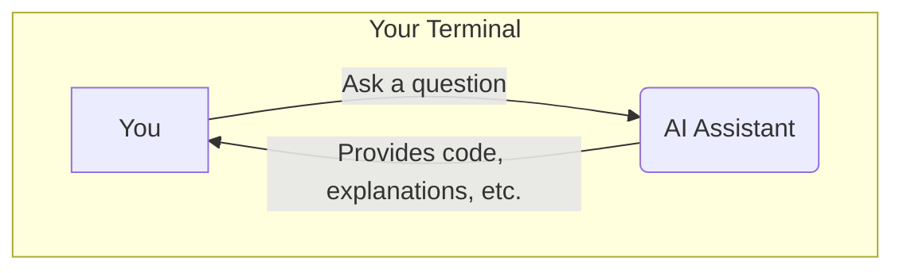

# 🤖 01: Setting Up Anthropic's Claude as a Coding Assistant

Welcome to the AI Assistants section! Here, we'll set up tools that can help you write code, debug problems, and learn new concepts directly from your terminal. First up is Claude.

### 🤔 What is a Command-Line AI Assistant?

An AI assistant in your terminal acts as a conversational partner for your coding tasks. You can ask it questions, ask for code suggestions, or get help with debugging errors without needing to open a web browser. It's a powerful way to stay focused and productive.

### ✨ The Goal

Our objective is to install the (hypothetical) `@anthropic-ai/claude-code` CLI tool using `npm` and connect it to your Anthropic account.



---

**Prerequisite:** You must have completed the [NVM and Node.js setup](../../03-development-tools/01-nvm-and-nodejs.md) from the previous section. This tool requires Node.js and `npm`.

---

Choose the guide that best fits your experience level below.

<details>
<summary>
  <strong>🌱 I'm a Complete Beginner</strong> - Click for a gentle, step-by-step guide.
</summary>

### Installing Your First AI Helper

We will use `npm` (the Node Package Manager that was installed with Node.js) to install the Claude command-line tool.

**Step 1: Install the Claude CLI Package**

This command uses `npm` to download and install the Claude tool on your system. The `-g` flag means "global," which makes the `claude` command available everywhere in your terminal. Because we used NVM to install Node.js, we don't need to use `sudo` here.

```bash
npm install -g @anthropic-ai/claude-code
```

**Step 2: Verify the Installation**

To make sure it worked, you can ask for its version number.

```bash
claude --version
```
If you see a version number, it's installed correctly!

**Step 3: Run and Authenticate**

The first time you run the tool, it will ask you to log in.

```bash
claude
```
It will likely prompt you to authenticate. Follow the on-screen instructions, which will probably involve logging into your Anthropic account in a web browser.

Once authenticated, you can start asking it questions right from your terminal!

</details>

<details>
<summary>
  <strong>🪟 I'm Coming From Windows</strong> - Click for a technical guide.
</summary>

### Installing the Claude CLI via npm

This process uses `npm` to install a global package. The workflow is identical on Windows, macOS, and Linux, assuming a correctly configured Node.js environment via NVM.

**Prerequisite Check:** Ensure Node.js and npm are in your `PATH`.
```bash
node -v && npm -v
```

**Step 1: Install the Global Package**

Use `npm install -g` to install the Claude CLI tool. NVM handles the permissions, so `sudo` is not necessary.

```bash
npm install -g @anthropic-ai/claude-code
```

**Step 2: Verify and Run**

Check the version to confirm the installation and then run the application.

```bash
claude --version
claude
```
On first run, you will be prompted to authenticate with your Anthropic account. Follow the interactive login flow.

</details>

<details>
<summary>
  <strong>🚀 I'm an Experienced User</strong> - Click for the quick script.
</summary>

### Install and Run Claude CLI

Ensure you are using a suitable Node.js version (e.g., LTS) managed by NVM.

```bash
# Install the package globally
npm install -g @anthropic-ai/claude-code

# Verify and run
claude --version
claude
```
Follow the prompts to authenticate on the first run.

</details>

---

### Next Steps

With Claude set up, let's add another powerful AI assistant to your toolkit: the Gemini CLI.

➡️ **Next: [02: Setting Up the Gemini CLI](./02-gemini-cli-setup.md)**

⬅️ **Previous Section: [03-development-tools/02-vscode-setup.md](../../03-development-tools/02-vscode-setup.md)**

↩️ **Back to [Main Menu](../../README.md)**
