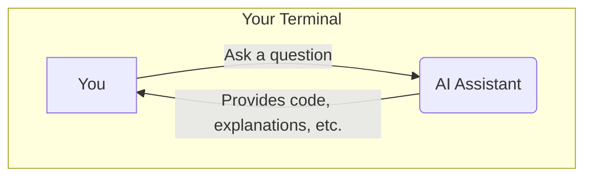

## 🤖 Part 5: AI Assistants

### 🤔 Understanding Claude Code's Role

AI assistants like Claude Code can help you write code faster and learn new things.



**Prerequisites setup**:
```bash
# Claude Code requires Node.js 18+
node --version  # Should show v18 or higher

# Configure npm for user-directory global installs
mkdir ~/.npm-global
npm config set prefix '~/.npm-global'
echo 'export PATH=~/.npm-global/bin:$PATH' >> ~/.bashrc
source ~/.bashrc
```

**Install Claude Code**:
```bash
# Install globally without sudo
npm install -g @anthropic-ai/claude-code

# Verify installation
claude --version

# Start Claude Code
claude
```

During first run, authenticate using either:
- **Anthropic Console**: For API access (requires billing)
- **Claude Pro/Max**: If you have a subscription