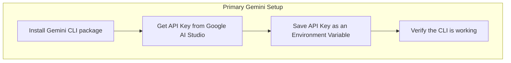

# 🤖 02: Setting Up Google's Gemini CLI

To round out your AI toolkit, we'll install the official Gemini CLI from Google. Having multiple AI assistants at your disposal is beneficial, as different models can have different strengths.

### 🤔 What is the Gemini CLI?

The Gemini CLI is a command-line tool that gives you direct access to Google's powerful Gemini family of AI models. You can use it for code generation, analysis, and a wide range of other development tasks, right from your terminal.

### ✨ The Goal

Our main goal is to install the Gemini CLI, get a free API key from Google AI Studio, and configure our terminal to use it.



---

## Part 1: Installation and Authentication

Choose the guide that best fits your experience level below.

<details>
<summary>
  <strong>🌱 I'm a Complete Beginner</strong> - Click for a gentle, step-by-step guide.
</summary>

### Installing Your Second AI Helper

Let's get the Gemini CLI installed using `npm`, just like we did with the Claude tool.

**Step 1: Install the Gemini CLI Package**

This command uses `npm` to download and install the Gemini tool globally on your system.

```bash
npm install -g @google/gemini-cli
```

**Step 2: Get Your API Key**

An API Key is like a special password that lets your computer securely talk to a service.
1.  Go to the [Google AI Studio](https://aistudio.google.com/apikey) website.
2.  You may need to log in with your Google account.
3.  Click **"Create API key in new project"**.
4.  A new key will be generated for you. **Copy this key immediately** and save it somewhere safe, like a notepad, for the next step.

**Step 3: Save Your API Key**

We need to tell your terminal about this key. We'll do this by adding it to a special configuration file called `~/.bashrc`.

This command will add a line to the end of that file. **Remember to replace `your_api_key_here` with the actual key you just copied.**

```bash
# This 'echoes' the line into your .bashrc file
echo 'export GEMINI_API_KEY="your_api_key_here"' >> ~/.bashrc
```

Now, apply the change to your current terminal session:
```bash
# This command reloads the .bashrc file
source ~/.bashrc
```

**Step 4: Verify the Installation**

Let's test it out! Run the tool with a simple prompt.

```bash
gemini-cli "hello"
```
If it responds with a greeting, you have successfully set up the Gemini CLI!

</details>

<details>
<summary>
  <strong>🪟 I'm Coming From Windows</strong> - Click for a technical guide.
</summary>

### Installing and Configuring the Gemini CLI

This guide covers installing the `@google/gemini-cli` npm package and configuring its authentication via an environment variable.

**Step 1: Install the Global Package**

```bash
npm install -g @google/gemini-cli
```

**Step 2: Obtain an API Key**

1.  Navigate to [Google AI Studio's API Key page](https://aistudio.google.com/apikey).
2.  Generate a new API key in a new or existing project.
3.  Copy the generated key.

**Step 3: Set the Environment Variable**

The Gemini CLI uses the `GEMINI_API_KEY` environment variable for authentication. We'll add it to `~/.bashrc` to make it persistent across terminal sessions.

```bash
# Append the export command to your .bashrc file.
# Replace the placeholder with your actual key.
echo 'export GEMINI_API_KEY="your_api_key_here"' >> ~/.bashrc

# Source the file to apply the variable to your current session.
source ~/.bashrc
```

**Step 4: Verify Operation**

Run a simple command to ensure the CLI is installed and authenticated correctly.

```bash
gemini-cli "Give me a one-sentence summary of the purpose of a reverse proxy."
```
A successful response confirms the setup is complete.

</details>

<details>
<summary>
  <strong>🚀 I'm an Experienced User</strong> - Click for the quick script.
</summary>

### Gemini CLI Setup

1.  Install the global npm package.
2.  Get an API key from [Google AI Studio](https://aistudio.google.com/apikey).
3.  Set the `GEMINI_API_KEY` environment variable.

```bash
# 1. Install the CLI
npm install -g @google/gemini-cli

# 2. Set the API Key (replace with your key)
echo 'export GEMINI_API_KEY="your_api_key_here"' >> ~/.bashrc
source ~/.bashrc

# 3. Verify
echo "API key set. Testing CLI..."
gemini-cli "hello"
```

</details>

---

## Part 2: Advanced Configuration (Optional)

The following configurations are optional but can enhance the CLI's capabilities.

### Using Context7 for Up-to-Date Docs

For access to the latest documentation for various libraries and frameworks, you can configure the CLI to use the context7 MCP server. You would need to edit the settings file (e.g., `~/.gemini/settings.json`) to include this configuration.

### Using a Local Model with Ollama

For privacy, offline use, or experimentation, you can run a local AI model using Ollama and have the Gemini CLI use it instead of Google's cloud service.

**1. Install Ollama:**
```bash
curl -fsSL https://ollama.com/install.sh | sh
```

**2. Download a model:**
```bash
ollama pull gemma
```

**3. Use the local model:**
The Ollama server runs automatically. You can now direct the Gemini CLI to use your local model with the `--model` flag.
```bash
gemini-cli --model ollama/gemma "your prompt here"
```

---

### Next Steps

Congratulations, your AI assistant toolkit is now complete! You are fully equipped with the essential tools for modern software development.

In the final section, we'll put it all together and create your very first project.

➡️ **Next Section: [05-your-first-project/01-project-creation.md](../../05-your-first-project/01-project-creation.md)**

⬅️ **Previous: [01: Setting Up Claude](./01-claude-code-setup.md)**

↩️ **Back to [Main Menu](../../README.md)**
