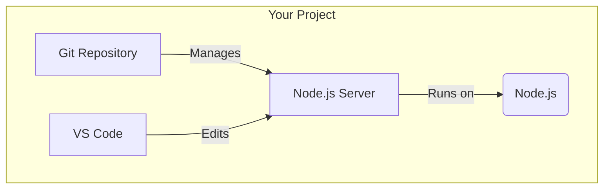

## 🎉 Part 5: Your First Project!

### 🚀 Creating Your First Integrated Project

Let's create a simple project to see how all your new tools work together.



```bash
# Create and enter project directory
mkdir my-first-project
cd my-first-project

# Set Node.js version for the project
echo "lts/*" > .nvmrc
nvm use

# Initialize Git repository
git init

# Initialize npm project
npm init -y

# Create a proper .gitignore
cat > .gitignore << 'EOL'
# Dependencies
node_modules/
*.log

# Environment variables
.env
.env.*

# IDE
.vscode/
.idea/

# OS
.DS_Store
Thumbs.db
EOL

# Install some development dependencies
npm install -D nodemon eslint prettier

# Create a simple server file
cat > index.js << 'EOL'
const http = require('http');

const server = http.createServer((req, res) => {
  res.writeHead(200, { 'Content-Type': 'text/plain' });
  res.end('Hello from your Ubuntu development environment!');
});

const PORT = process.env.PORT || 3000;
server.listen(PORT, () => {
  console.log(`Server running at http://localhost:${PORT}`);
});
EOL

# Add npm scripts
npm pkg set scripts.start="node index.js"
npm pkg set scripts.dev="nodemon index.js"

# Open in VS Code
code .
```