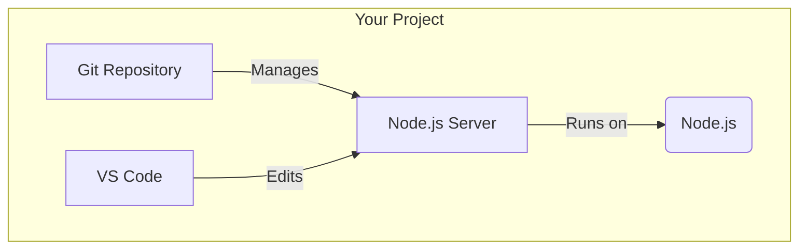

# 🎉 01: Creating Your First Project

Congratulations on making it to the final section! It's time to put everything you've learned into practice. We will now create a simple web server project from scratch, using all the tools you've set up.

### 🤔 What Are We Building?

We will create a basic "Hello World" web server using Node.js. This project will be managed with Git, use a specific Node.js version defined by NVM, and we'll edit it with VS Code. It's a perfect example of a real-world development workflow.

### ✨ The Goal

Our objective is to tie all the pieces together: terminal commands, Git, NVM, Node.js, npm, and VS Code.



---

This guide is a single, step-by-step tutorial for everyone. Follow along and execute each command in your terminal.

<details>
<summary>
<strong>Step 1: Create the Project Directory</strong>
</summary>

First, let's create a folder for our project and move into it.

```bash
# Create a new directory named 'my-first-project'
mkdir my-first-project

# Change your current location to the new directory
cd my-first-project
```

</details>

<details>
<summary><strong>Step 2: Set the Node.js Version for the Project</strong></summary>

To ensure this project always uses the right version of Node.js (even if you install new versions later), we create a special file called `.nvmrc`.

```bash
# Create the .nvmrc file and put the text "lts/*" inside it
echo "lts/*" > .nvmrc

# Tell nvm to use the version specified in the .nvmrc file
nvm use
```
Now, anyone who clones your project can run `nvm use` to get the exact same Node.js version.

</details>

<details>
<summary><strong>Step 3: Initialize the Git Repository</strong></summary>

Let's turn this folder into a Git repository to start tracking our changes.

```bash
git init
```
You'll see a message that an empty Git repository has been initialized.

</details>

<details>
<summary><strong>Step 4: Initialize the Node.js Project</strong></summary>

Now, let's turn this folder into a Node.js project by creating a `package.json` file. This file holds information about our project and its dependencies.

```bash
# The -y flag accepts all the default options.
npm init -y
```
Have a look at the `package.json` file that was created!

</details>

<details>
<summary><strong>Step 5: Create a `.gitignore` File</strong></summary>

This is a very important file that tells Git which files or folders it should *ignore*. We never want to commit the `node_modules` folder, which will be created in the next step.

```bash
# This command creates a .gitignore file with a standard list of things to ignore.
cat > .gitignore << 'EOL'
# Dependencies
node_modules/
*.log

# Environment variables
.env
.env.*

# IDE
.vscode/
.idea/

# OS
.DS_Store
Thumbs.db
EOL
```

</details>

<details>
<summary><strong>Step 6: Install Development Dependencies</strong></summary>

Let's install some helpful tools for our project. The `-D` flag saves them as "development dependencies," meaning they are only needed for development, not for running the project in production.

```bash
npm install -D nodemon eslint prettier
```
*   **`nodemon`**: Automatically restarts your server when you change a file.
*   **`eslint`**: Finds and reports problems in your code.
*   **`prettier`**: Automatically formats your code to keep it clean.

> You'll now see a `node_modules` folder. This is where `npm` downloads the code for your dependencies. To learn more, check out the [Understanding npm and node_modules](./04-understanding-npm-and-node_modules.md) guide.

</details>

<details>
<summary><strong>Step 7: Create the Server File</strong></summary>

Let's create the main file for our web server, `index.js`.

```bash
# This command creates the index.js file with a simple server script inside.
cat > index.js << 'EOL'
const http = require('http');

const server = http.createServer((req, res) => {
  res.writeHead(200, { 'Content-Type': 'text/plain' });
  res.end('Hello from your Ubuntu development environment!');
});

const PORT = process.env.PORT || 3000;
server.listen(PORT, () => {
  console.log(`Server running at http://localhost:${PORT}`);
});
EOL
```

</details>

<details>
<summary><strong>Step 8: Add Scripts to `package.json`</strong></summary>

We can add shortcuts to our `package.json` file to make running our server easier.

```bash
# Add a 'start' script to run the server normally
npm pkg set scripts.start="node index.js"

# Add a 'dev' script to run the server with nodemon for development
npm pkg set scripts.dev="nodemon index.js"
```

</details>

<details>
<summary><strong>Step 9: Open in VS Code and Run!</strong></summary>

Everything is set up. Let's open the project in VS Code and start the server.

```bash
# Open the current directory in VS Code
code .
```
Once VS Code is open, open the integrated terminal (`Ctrl+\`)
and run the development server:
```bash
npm run dev
```
You should see the message `Server running at http://localhost:3000`. You can open this URL in your web browser to see your server in action!

</details>

---

### Next Steps

You have successfully created and run a real Node.js project! This is a huge milestone.

In the next guide, we'll go through a checklist to verify that everything you've set up is working perfectly.

➡️ **Next: [02: Verification Checklist](./02-verification-checklist.md)**

⬅️ **Previous Section: [04-ai-assistants/02-gemini-cli-setup.md](../../04-ai-assistants/02-gemini-cli-setup.md)**

↩️ **Back to [Main Menu](../../README.md)**
