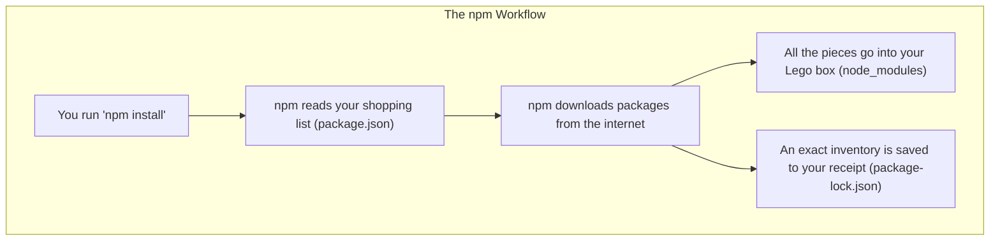

# 📦 04: Demystifying npm and the `node_modules` Folder

When you start working with Node.js projects, you'll immediately encounter `npm`, `package.json`, and the giant `node_modules` folder. Understanding what they do is one of the most important steps to becoming a confident JavaScript developer.

### 🤔 What is All This Stuff?

At its heart, the Node.js ecosystem is about sharing and using code. These files and folders are the machinery that makes it all work. Instead of writing everything from scratch, you can use "packages" of code written by other developers to add features to your application.

### ✨ The Goal: A Lego Analogy

Let's think about building a project like building a model with Lego.



---

### `npm`: The Giant Lego Store

`npm` stands for Node Package Manager. It is two things:
1.  A massive online library (or registry) of free, reusable code packages. Think of it as a giant Lego store that has every type of brick imaginable.
2.  A command-line tool (`npm`) that helps you "shop" for packages and manage them for your project.

### `package.json`: Your Shopping List

This file is the blueprint for your project. It lists all the main "Lego kits" (packages) you need. When you run `npm install some-package`, you are adding that package to your shopping list.

It also contains other important information like your project's name, version, and any `scripts` you've defined.

**Example `package.json`:**
```json
{
  "name": "my-first-project",
  "version": "1.0.0",
  "dependencies": {
    "express": "^4.18.2" // This is a dependency - a package we need
  },
  "devDependencies": {
    "nodemon": "^3.0.1" // This is a dev dependency - a tool we need for development
  }
}
```

### `node_modules`: Your Big Box of Lego Pieces

After you run `npm install`, `npm` looks at your `package.json` shopping list, goes to the "store," and downloads all the packages you asked for. It puts all of that code into the `node_modules` folder.

This folder is often very large because it contains not only the packages you asked for directly, but also all the packages *those* packages depend on, and so on. It's your complete collection of every single brick you need.

### `package-lock.json`: The Super-Detailed Receipt

This is maybe the most important file. When `npm` installs your packages, it generates `package-lock.json`. This file is a snapshot of your *exact* `node_modules` folder at that moment. It records the specific version of every single package and sub-package.

**Why is this critical?** It guarantees that every developer on your team, and your production server, will install the *exact same versions* of all dependencies. This prevents "it works on my machine" problems and ensures your project is perfectly reproducible.

### Why You MUST `.gitignore` `node_modules`

You should **never** commit the `node_modules` folder to Git.
1.  **It's huge:** It would bloat your repository with thousands of files.
2.  **It's redundant:** Your `package.json` (the list) and `package-lock.json` (the receipt) are all anyone needs.

By committing `package.json` and `package-lock.json`, you can be sure that anyone who clones your project can run `npm install` and perfectly recreate the exact same `node_modules` folder.

You share the shopping list and the receipt, not the giant box of Legos.

---

### You've Reached the End!

Congratulations on completing this entire guide. You have built a professional development environment and learned the foundational concepts behind it. You are well-equipped to continue your journey.

⬅️ **Previous: [03: Next Steps](./03-next-steps.md)**

↩️ **Back to [Main Menu](../../README.md)**