# 🚀 Welcome to Your Developer Setup Guide! 🚀

Hello there! This guide is your launchpad into the exciting world of software development. We'll help you set up a professional development environment on your Ubuntu machine, tailored to your experience level.

## 🎯 First, Find Your Starting Point

We all start somewhere! To make your journey smooth, we've created different starting points. Pick the one that best describes you to get this guide onto your own GitHub account—a crucial first step for every developer.

<details>
<summary>
  <strong>🌱 I'm a Complete Beginner (New to the Terminal)</strong> - Click here if you've never used a command-line terminal before.
</summary>

### Welcome! We're excited to have you.

The **terminal** (or command line) is a powerful tool that lets you talk to your computer directly with text commands. It might look intimidating, but it's a developer's best friend! Think of it as a more direct way of doing things you might normally do with a mouse, like creating folders or opening files.

You can open the terminal on Ubuntu by pressing `Ctrl+Alt+T` or by searching for "Terminal" in your applications.

Now, let's get this guide onto your personal GitHub page.

1.  <strong>Create a GitHub Account:</strong> If you don't have one, head over to [GitHub.com](https://github.com) and sign up. It's free and it's like a home for all your code.

2.  <strong>Create a New "Repository":</strong> A repository (or "repo") is just a fancy word for a project's folder. On your GitHub account, create a new repository. You can name it something like `my-dev-setup`.

3.  <strong>Upload This Guide to Your Repository:</strong> Now, we'll use the terminal to upload the files in this folder to your new repository. Just copy and paste each command below into your terminal, one at a time, and press Enter. We'll explain what each one does.

    *   <strong>Step 1: Initialize Git</strong>
        This command tells your computer to start tracking this folder as a project.
        ```bash
        git init
        ```

    *   <strong>Step 2: Add all the files</strong>
        This command prepares all the files in this folder to be saved. The `.` just means "all the files here".
        ```bash
        git add .
        ```

    *   <strong>Step 3: Make your first "commit"</strong>
        This command takes a snapshot of your files and saves it. The `-m "Initial commit"` part is a message to describe what you did.
        ```bash
        git commit -m "Initial commit"
        ```

    *   <strong>Step 4: Set the main "branch"</strong>
        Think of branches like different versions of your project. This command names your main version `main`.
        ```bash
        git branch -M main
        ```

    *   <strong>Step 5: Connect to your GitHub repository</strong>
        This command creates a connection between the folder on your computer and the repository you created on GitHub. <strong>Remember to replace `<your-github-repository-url>` with the URL of your new repository!</strong> You can find this URL on your repository's page on GitHub.
        ```bash
        git remote add origin <your-github-repository-url>
        ```

    *   <strong>Step 6: "Push" your code to GitHub</strong>
        This command uploads (pushes) your saved files from your computer to your GitHub repository.
        ```bash
        git push -u origin main
        ```

Great job! You've just used Git and GitHub like a pro. Now you can follow the rest of the guide from your own repository!

</details>

<details>
<summary>
  <strong>🪟 I'm Coming From Windows</strong> - Click here if you're comfortable with Windows but new to the Linux terminal.
</summary>

### Welcome to the Linux world!

You'll find the Linux terminal is a lot like Windows Command Prompt or PowerShell, but with its own set of powerful commands. Here are a few quick tips:
*   Instead of `dir`, you'll use `ls` to list files.
*   File paths use forward slashes (`/`) instead of backslashes (`\`). For example: `/home/user/project` instead of `C:\Users\user\project`.
*   Your main drive isn't `C:`. Everything starts from the root directory, `/`.

Now, let's get this guide onto your personal GitHub page.

1.  <strong>Create a GitHub Account:</strong> If you don't have one, head over to [GitHub.com](https://github.com) and sign up.

2.  <strong>Create a New Repository:</strong> On your GitHub account, create a new repository. Let's call it `my-dev-setup`.

3.  <strong>Push this Guide to Your Repository:</strong> Open the Ubuntu terminal (`Ctrl+Alt+T`) and run the following commands. They work very similarly to how `git` works on Windows.

    *   <strong>Step 1: Initialize Git</strong>
        Initializes a new Git repository in the current directory.
        ```bash
        git init
        ```

    *   <strong>Step 2: Stage all files</strong>
        Stages all files and directories in the current path for the next commit.
        ```bash
        git add .
        ```

    *   <strong>Step 3: Make your first commit</strong>
        Commits the staged files with a descriptive message.
        ```bash
        git commit -m "Initial commit"
        ```

    *   <strong>Step 4: Set the main branch</strong>
        Sets the primary branch name to `main`, a common convention.
        ```bash
        git branch -M main
        ```

    *   <strong>Step 5: Add your remote repository</strong>
        Connects your local repository to the remote one on GitHub. <strong>Remember to replace `<your-github-repository-url>` with your repository's URL!</strong>
        ```bash
        git remote add origin <your-github-repository-url>
        ```

    *   <strong>Step 6: Push your code to GitHub</strong>
        Uploads your local `main` branch to the `origin` remote and sets it as the upstream branch.
        ```bash
        git push -u origin main
        ```

Excellent! You're all set. Now you can follow the rest of the guide from your own repository.

</details>

<details>
<summary>
  <strong>🚀 I'm an Experienced User</strong> - Click here for the quick setup.
</summary>

### Quick Start

If you're familiar with Git and the terminal, here are the commands to get this repo set up under your own account.

1. Create a new, empty repository on GitHub.
2. Run the following commands in your local copy of this project, replacing the remote URL with your own.

```bash
git init
git add .
git commit -m "Initial commit"
git branch -M main
git remote add origin <your-github-repository-url>
git push -u origin main
```

</details>

--- 

## 🗺️ What's Inside?

Once you've completed your first mission, you're ready to dive in! This guide is broken down into several sections, each in its own folder. Just follow them in order, and you'll be all set!

Here's a quick overview of what you'll be doing:

```mermaid
graph TD
    A[Start Here: Your First Mission] --> B[01: Ubuntu Setup 🐧];
    B --> C[02: Git & GitHub 🐙];
    C --> D[03: Development Tools 🛠️];
    D --> E[04: AI Assistants 🤖];
    E --> F[05: Your First Project 🎉];
```



### 📚 Guide Sections

#### [01: Ubuntu Setup](01-ubuntu-setup/) 🐧
- [Removing Snap](01-ubuntu-setup/01-removing-snap.md) - Clean system foundation
- [Installing Firefox](01-ubuntu-setup/02-installing-firefox.md) - Native browser setup
- [Essential Packages](01-ubuntu-setup/03-essential-packages.md) - Development toolkit

#### [02: Git & GitHub](02-git-and-github/) 🐙
- [Git Configuration](02-git-and-github/01-git-configuration.md) - Professional Git setup
- [SSH Keys](02-git-and-github/02-ssh-keys.md) - Secure authentication
- [Git Aliases](02-git-and-github/03-git-aliases.md) - Productivity shortcuts
- [GitHub CLI](02-git-and-github/04-github-cli.md) - Command-line GitHub

#### [03: Development Tools](03-development-tools/) 🛠️
- [NVM and Node.js](03-development-tools/01-nvm-and-nodejs.md) - JavaScript ecosystem
- [VS Code Setup](03-development-tools/02-vscode-setup.md) - Your coding environment

#### [04: AI Assistants](04-ai-assistants/) 🤖
- [Claude Code Setup](04-ai-assistants/01-claude-code-setup.md) - AI coding assistant
- [Gemini CLI Setup](04-ai-assistants/02-gemini-cli-setup.md) - Google's AI helper

#### [05: Your First Project](05-your-first-project/) 🎉
- [Project Creation](05-your-first-project/01-project-creation.md) - Starting your project
- [Verification Checklist](05-your-first-project/02-verification-checklist.md) - Confirm everything works
- [Next Steps](05-your-first-project/03-next-steps.md) - Continue learning
- [Understanding npm](05-your-first-project/04-understanding-npm-and-node_modules.md) - Learn about dependencies

## ✅ Documentation Status

**Last Verified: August 2025**

All instructions in this guide have been verified against the latest documentation:
- ✅ **NVM v0.40.3** - Latest stable version
- ✅ **Claude Code** - Current installation method
- ✅ **GitHub CLI** - Official apt repository
- ✅ **VS Code** - Microsoft repository method
- ✅ **Context7 MCP** - Configured for latest docs access

Now, let's get started! Head over to the [Ubuntu Setup Guide](01-ubuntu-setup/01-removing-snap.md) to begin.