# 🚀 Welcome to Your Developer Setup Guide! 🚀

Hello there! This guide is your first step into the exciting world of software development. We'll set up a professional development environment on your computer, just like the pros use!

## 🎯 Your First Mission: Get on GitHub!

Before we begin, your first task is to get this guide onto your own GitHub account. This is a crucial first step for every developer.

1.  **Create a GitHub Account:** If you don't have one, head over to [GitHub.com](https://github.com) and sign up. It's free!

2.  **Create a New Repository:** On your GitHub account, create a new repository. You can name it something like `my-dev-setup`.

3.  **Push this Guide to Your Repository:** Now, we'll upload the files in this folder to your new repository. Just copy and paste each command below into your terminal, one at a time, and press Enter.

    *   **Step 1: Initialize Git**
        This command sets up a new Git repository in this folder.
        ```bash
        git init
        ```

    *   **Step 2: Add all the files**
        This command adds all the files in this folder to your new repository.
        ```bash
        git add .
        ```

    *   **Step 3: Make your first commit**
        This command saves your files in the repository's history.
        ```bash
        git commit -m "Initial commit"
        ```

    *   **Step 4: Set the main branch**
        This command sets the main branch name to `main`.
        ```bash
        git branch -M main
        ```

    *   **Step 5: Add your remote repository**
        This command connects your local repository to your new repository on GitHub. **Remember to replace `<your-github-repository-url>` with the URL of your new repository!**
        ```bash
        git remote add origin <your-github-repository-url>
        ```

    *   **Step 6: Push your code to GitHub**
        This command uploads your files to your GitHub repository.
        ```bash
        git push -u origin main
        ```

Once you've done that, you can follow along with the guide from your own repository!

## 🗺️ What's Inside?

This guide is broken down into several sections, each in its own folder. Just follow them in order, and you'll be all set!

Here's a quick overview of what you'll be doing:

```mermaid
graph TD
    A[Start Here: Your First Mission] --> B[01: Ubuntu Setup 🐧];
    B --> C[02: Git & GitHub 🐙];
    C --> D[03: Development Tools 🛠️];
    D --> E[04: AI Assistants 🤖];
    E --> F[05: Your First Project 🎉];
```



### 📚 Guide Sections

#### [01: Ubuntu Setup](01-ubuntu-setup/) 🐧
- [Removing Snap](01-ubuntu-setup/01-removing-snap.md) - Clean system foundation
- [Installing Firefox](01-ubuntu-setup/02-installing-firefox.md) - Native browser setup
- [Essential Packages](01-ubuntu-setup/03-essential-packages.md) - Development toolkit

#### [02: Git & GitHub](02-git-and-github/) 🐙
- [Git Configuration](02-git-and-github/01-git-configuration.md) - Professional Git setup
- [SSH Keys](02-git-and-github/02-ssh-keys.md) - Secure authentication
- [Git Aliases](02-git-and-github/03-git-aliases.md) - Productivity shortcuts
- [GitHub CLI](02-git-and-github/04-github-cli.md) - Command-line GitHub

#### [03: Development Tools](03-development-tools/) 🛠️
- [NVM and Node.js](03-development-tools/01-nvm-and-nodejs.md) - JavaScript ecosystem
- [VS Code Setup](03-development-tools/02-vscode-setup.md) - Your coding environment

#### [04: AI Assistants](04-ai-assistants/) 🤖
- [Claude Code Setup](04-ai-assistants/01-claude-code-setup.md) - AI coding assistant
- [Gemini CLI Setup](04-ai-assistants/02-gemini-cli-setup.md) - Google's AI helper

#### [05: Your First Project](05-your-first-project/) 🎉
- [Project Creation](05-your-first-project/01-project-creation.md) - Starting your project
- [Verification Checklist](05-your-first-project/02-verification-checklist.md) - Confirm everything works
- [Next Steps](05-your-first-project/03-next-steps.md) - Continue learning

## ✅ Documentation Status

**Last Verified: August 2025**

All instructions in this guide have been verified against the latest documentation:
- ✅ **NVM v0.40.3** - Latest stable version
- ✅ **Claude Code** - Current installation method
- ✅ **GitHub CLI** - Official apt repository
- ✅ **VS Code** - Microsoft repository method
- ✅ **Context7 MCP** - Configured for latest docs access

Now, let's get started! Head over to the [Ubuntu Setup Guide](01-ubuntu-setup/01-removing-snap.md) to begin.
